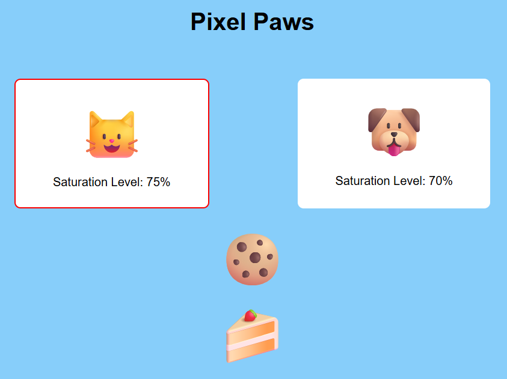

# 🧩 Pixel Paws

> This program implements a virutal pet simulation game, allowing the user to manage the hunger of two distinct pets.

---

## 🚀 Notable Features
- Object-Oriented programming, contructors.
  
---

## 🖼️ Preview

### Screenshot

---
