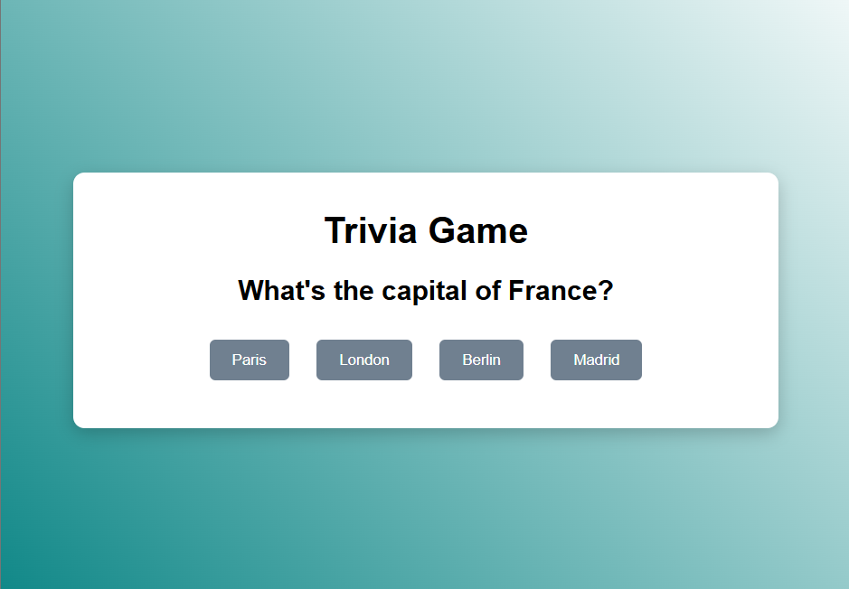

# 🧩 Typewriter portfolio

> This program implements the logic for a simple multiple-choice quiz.

---

## 🚀 Features
- Data arrays, State variables, dynamic display
  
---

## 🖼️ Preview

### Screenshot

---
