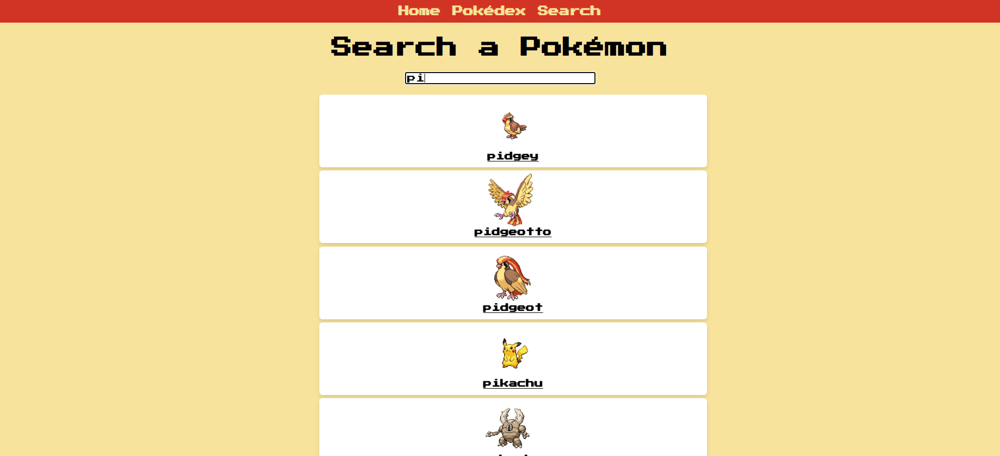

# 🧩 Pokedex

> This this react project implements a program that displays and searches objects in a list. It also shows info on every object by fetching from a database.

---

## 🚀 Notable Features
- State variables, hooks, conditional rendering, routing, asyncronous functions.
  
---

## 🖼️ Preview

### Screenshot

---